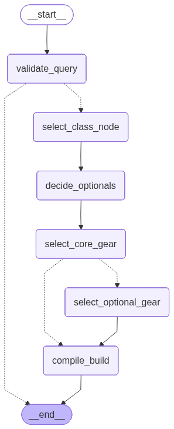

# Elden Ring Character Build Generator

A Retrieval-Augmented Generation (RAG) and LangGraph-powered AI agent that builds highly detailed Elden Ring character builds based on user requests.

## Overview

This project uses OpenAI's Language Models combined with a FAISS vector database to generate complete Elden Ring builds. By breaking the generation process down into a directed AI workflow using **LangGraph**, the agent reliably extracts relevant in-game items (weapons, armor, talismans, spirits, and spells) and synthesizes them into a Markdown guide.

## Key Features

- **Strict User Query Validation**: A "Gatekeeper" node rejects out-of-universe queries, modern technology, or requests for items from other games.
- **RAG-Powered Extraction**: Uses `langchain` and `FAISS` to retrieve specific, accurate Elden Ring data (no hallucinated items).
- **Dynamic AI Workflow**: The graph intelligently decides whether a requested build type requires optional gear (like Sorceries, Incantations, or Bows) and routes the execution flow accordingly.
- **Parallel Gear Search**: Retrieves core gear (Weapons, Armor, Talismans, Spirits) efficiently.
- **Pydantic Structured Outputs**: Guarantees that the LLM returns properly typed item lists.

## Project Structure

```text
elden-ring/
├── code/                    # Main application package
│   ├── main.py              # Entry point for the CLI script
│   ├── graph.py             # LangGraph edge routing and compilation 
│   ├── nodes.py             # LangGraph node logic and LLM interactions
│   ├── models.py            # Pydantic models & TypedDict state definitions
│   └── vectorstore.py       # FAISS index initialization and RAG retrievers
├── data/ 
│   ├── elden-ring-data/     # Elden Ring items data
│   ├── rag_data/            # Markdown documents of Elden Ring items, categorized by folder
│   └── faiss_index/         # Persisted local FAISS vector store database
├── figures/                 # Figures and diagrams
├── notebooks/               # Jupyter notebook testing the RAG and LangGraph
├── poetry.lock              # Poetry dependency lockfile
└── pyproject.toml           # Poetry project configuration
```

## Setup & Installation

**Prerequisites:** Python 3.11+ and [Poetry](https://python-poetry.org/) package manager.

1. **Install Dependencies:**
   Navigate to the project root and install the required packages:
   ```bash
   poetry install
   ```

2. **Environment Variables:**
   Create a `.env` file in the root directory and add your OpenAI API Key:
   ```env
   OPENAI_API_KEY=your_actual_api_key_here
   ```

3. **Data Requirements:**
   Ensure that the `data/rag_data/` directory contains the correct categorization of markdown files (e.g., `weapons/`, `armors/`, `classes/`, `talismans/`, etc.) so the initial FAISS index can be built successfully.

## Usage

### Running the Script

You can run the build generator directly from the root using Poetry:

```bash
poetry run python code/main.py
```

*Note: The script currently defaults to "I want a frost mage build" as an example query. You can edit `user_query` in `code/main.py` to prompt different builds (e.g., "Strength/Faith Paladin", "Bleed Samurai", "Dragon Communion").*

### Running in a Notebook

To interact with the project directly via a Jupyter Notebook (like `notebooks/testing.ipynb`), ensure you append the absolute path of the `code` directory to your `sys.path` so Python can resolve your local modules without conflict:

```python
import sys
import os
sys.path.append(os.path.abspath(os.path.join("..", "code")))

from main import generate_elden_ring_build
from graph import create_build_graph
# ... proceed with LangGraph initialization
```

## Architecture 

The LangGraph StateGraph executes in the following sequence:



1. **Validate Query:** Gatekeeper agent checks the feasibility of the user's Elden Ring request.
2. **Select Class:** Chooses the optimal starting class strictly via RAG context.
3. **Decide Optionals:** Analyzes the build to see if Spells, Shields, or Ammo are needed.
4. **Select Core Gear:** Parallel retrieval of Weapons, Armor, Talismans, and Spirit Ashes.
5. **Select Optional Gear:** (Conditional) Parallel retrieval of Sorceries, Incantations, Shields, or Ammo.
6. **Compile Build:** Synthesizes the extracted lists into a final, formatted Markdown guide.
